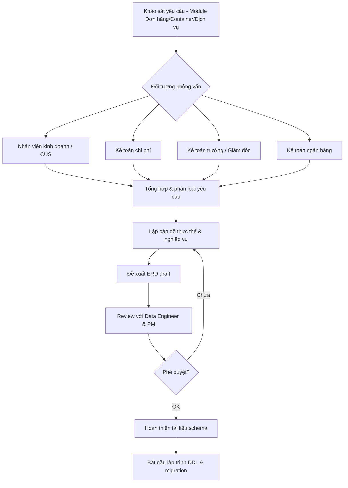
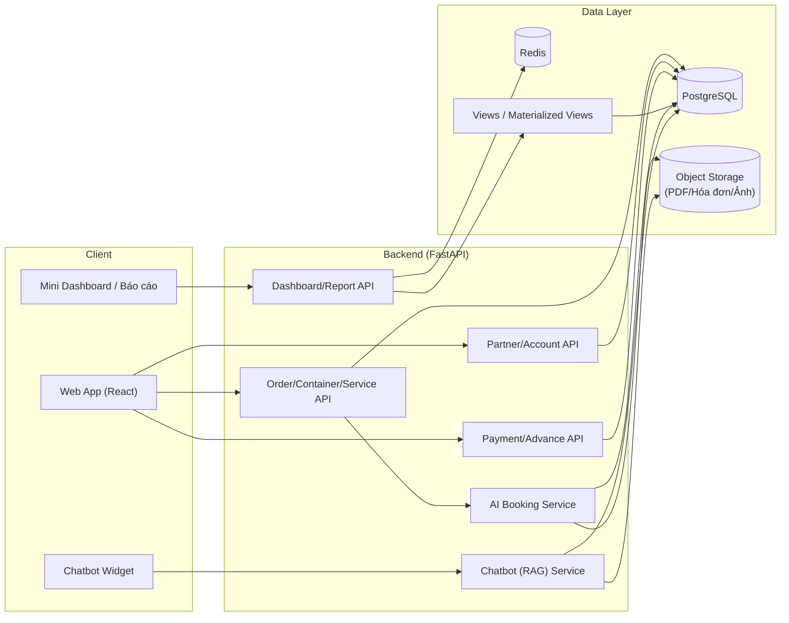
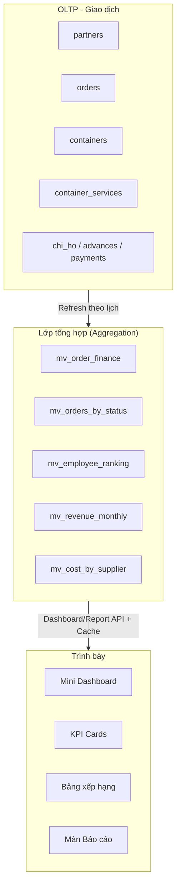
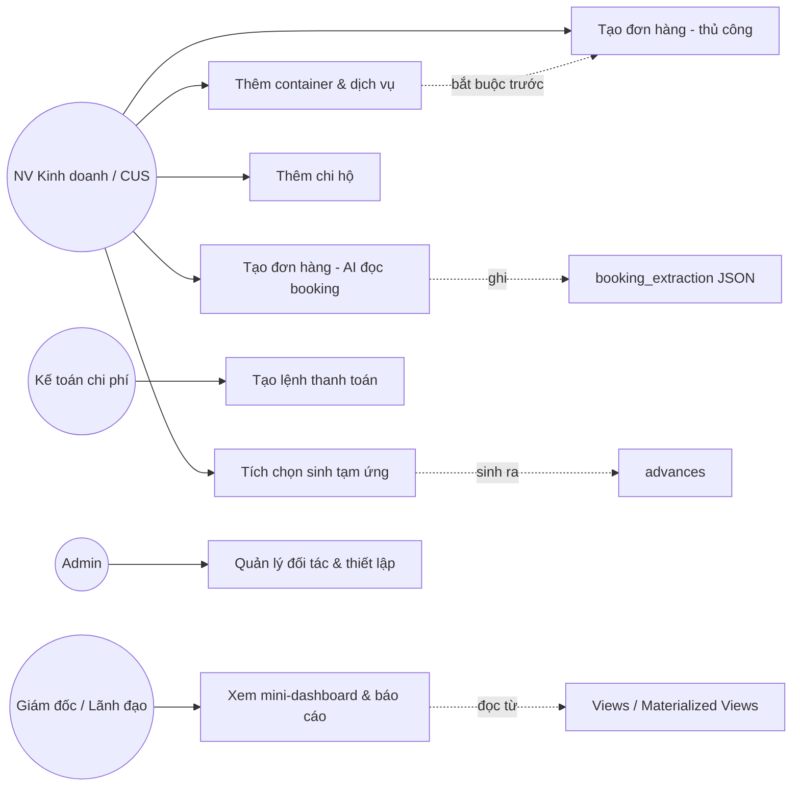
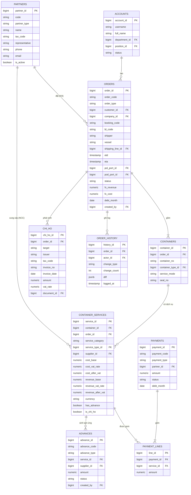
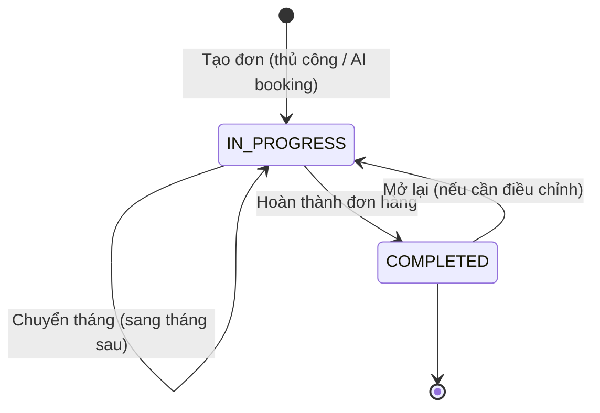
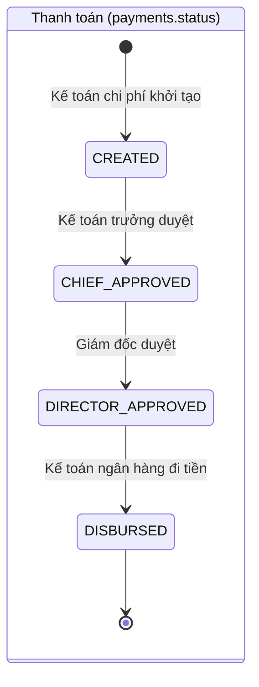
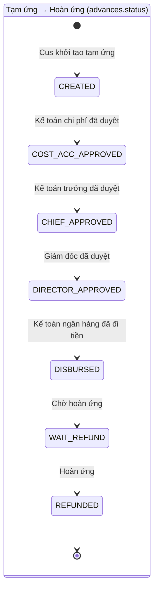
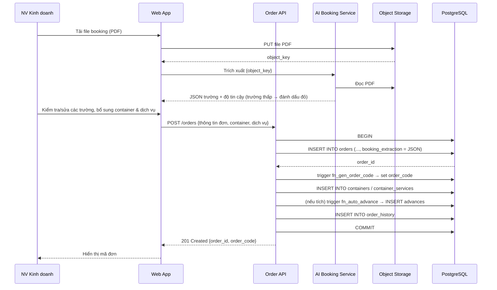

# BÁO CÁO THỰC TẬP KỸ THUẬT

**Đơn vị thực tập:** Công ty Cổ phần Công nghệ DSEA (DSEA Technology)

**Chuyên ngành:** Hệ thống thông tin quản lý

**Sinh viên thực hiện:** [Họ và tên sinh viên]

**Mã số sinh viên:** [MSSV]

**Lớp:** Hệ thống thông tin quản lý — K[XX]

**Khoa Toán — Tin, Đại học Bách Khoa Hà Nội**

**Hà Nội, 2025**

---

## Lời cảm ơn

Tôi xin chân thành cảm ơn **Công ty Cổ phần Công nghệ DSEA (DSEA Technology)** đã tạo điều kiện cho tôi được thực tập trong một môi trường làm việc chuyên nghiệp, hiện đại và đầy năng động. Trong suốt thời gian thực tập tại công ty, tôi đã có cơ hội tham gia trực tiếp vào dự án xây dựng **nền tảng quản lý giao nhận vận tải (logistics forwarder) ứng dụng trí tuệ nhân tạo** cho doanh nghiệp logistics — một dự án có quy mô lớn, gắn chặt với nghiệp vụ xuất nhập khẩu, tài chính — kế toán và ứng dụng nhiều công nghệ hiện đại như trích xuất thông tin booking bằng AI, trợ lý ảo (chatbot) huấn luyện theo tài liệu, và phân tích dữ liệu vận hành — tài chính trên dashboard.

Tôi đặc biệt cảm ơn Ban lãnh đạo, anh **CEO & Co-Founder** cùng anh **Project Manager** của nhóm phát triển 7 thành viên, các anh chị kỹ sư dữ liệu (Data Engineer) và kỹ sư phần mềm (Software Engineer) đã trực tiếp hướng dẫn, chỉ bảo tận tâm trong từng đầu việc về thiết kế cơ sở dữ liệu, viết truy vấn tổng hợp, và lớp dữ liệu cho dashboard. Các anh chị luôn sẵn sàng chia sẻ kinh nghiệm thực tế và xây dựng một môi trường làm việc cởi mở, giúp tôi tự tin hơn với nghề và hoàn thiện bản thân.

Tôi cũng xin gửi lời cảm ơn sâu sắc đến các thầy cô **Khoa Toán — Tin, Đại học Bách Khoa Hà Nội** đã trang bị cho tôi nền tảng kiến thức về cơ sở dữ liệu, hệ thống thông tin và phân tích nghiệp vụ — những kiến thức nền giúp tôi áp dụng được trong môi trường thực tế.

Một lần nữa, tôi xin gửi lời cảm ơn chân thành đến Ban lãnh đạo và tất cả các anh chị đồng nghiệp tại DSEA Technology vì sự hỗ trợ và quan tâm trong suốt thời gian qua!

*Hà Nội, ngày … tháng … năm 2025*

*Sinh viên*

**[Họ và tên sinh viên]**

---

## Mục lục

- [Danh sách bảng](#danh-sách-bảng)
- [Danh sách hình vẽ](#danh-sách-hình-vẽ)
- [Chương 1. Giới thiệu cơ sở thực tập](#chương-1-giới-thiệu-cơ-sở-thực-tập)
  - [1.1 Công ty Cổ phần Công nghệ DSEA](#11-công-ty-cổ-phần-công-nghệ-dsea)
- [Chương 2. Cơ sở lý thuyết](#chương-2-cơ-sở-lý-thuyết)
  - [2.1 Các khái niệm cơ bản](#21-các-khái-niệm-cơ-bản)
  - [2.2 Công cụ và công nghệ sử dụng](#22-công-cụ-và-công-nghệ-sử-dụng)
- [Chương 3. Giới thiệu chung về dự án](#chương-3-giới-thiệu-chung-về-dự-án)
  - [3.1 Tổng quan dự án](#31-tổng-quan-dự-án)
  - [3.2 Khảo sát yêu cầu phần đảm nhận](#32-khảo-sát-yêu-cầu-phần-đảm-nhận)
  - [3.3 Phạm vi và mục tiêu phần đảm nhận](#33-phạm-vi-và-mục-tiêu-phần-đảm-nhận)
  - [3.4 Kiến trúc tổng thể hệ thống](#34-kiến-trúc-tổng-thể-hệ-thống)
  - [3.5 Thiết kế cơ sở dữ liệu](#35-thiết-kế-cơ-sở-dữ-liệu)
  - [3.6 Hỗ trợ Dashboard và Báo cáo](#36-hỗ-trợ-dashboard-và-báo-cáo)
  - [3.7 Kiểm thử và triển khai](#37-kiểm-thử-và-triển-khai)
- [Kết luận](#kết-luận)
- [Tài liệu tham khảo](#tài-liệu-tham-khảo)

---

## Danh sách bảng

| STT | Tên bảng | Trang |
|-----|----------|-------|
| 2.1 | So sánh PostgreSQL với MySQL trong bối cảnh dự án | — |
| 3.1 | Mô tả các tác nhân (actors) sử dụng hệ thống | — |
| 3.2 | Bảng `partners` — Đối tác (NCC & Khách hàng) | — |
| 3.3 | Bảng `orders` — Đơn hàng (booking) | — |
| 3.4 | Bảng `containers` — Container | — |
| 3.5 | Bảng `container_services` — Dịch vụ container | — |
| 3.6 | Bảng `chi_ho` — Chi hộ | — |
| 3.7 | Bảng `advances` — Tạm ứng / Hoàn ứng | — |
| 3.8 | Bảng `payments` & `payment_lines` — Thanh toán | — |
| 3.9 | Các bảng danh mục (Thiết lập chung) | — |
| 3.10 | Danh mục truy vấn/aggregation phục vụ mini-dashboard & báo cáo | — |
| 3.11 | Danh mục KPI/widget hỗ trợ | — |

## Danh sách hình vẽ

| STT | Tên hình | Trang |
|-----|----------|-------|
| 3.1 | Quy trình khảo sát yêu cầu module đảm nhận | — |
| 3.2 | Sơ đồ kiến trúc tổng thể nền tảng | — |
| 3.3 | Vị trí Database trong kiến trúc (OLTP — Aggregation — Trình bày) | — |
| 3.4 | Use Case module Đơn hàng — Container — Dịch vụ | — |
| 3.5 | ERD module Đơn hàng — Container — Dịch vụ | — |
| 3.6 | Sơ đồ trạng thái đơn hàng | — |
| 3.7 | Sơ đồ tuần tự — Thêm đơn hàng bằng AI đọc booking | — |
| 3.8 | Sơ đồ trạng thái (state machine) luồng duyệt Thanh toán / Tạm ứng | — |
| 3.9 | Ảnh sản phẩm — Mini dashboard đơn hàng | — |
| 3.10 | Ảnh sản phẩm — Màn Báo cáo | — |

---

# Chương 1. Giới thiệu cơ sở thực tập

## 1.1 Công ty Cổ phần Công nghệ DSEA

### 1.1.1 Thông tin chung

Công ty Cổ phần Công nghệ DSEA (DSEA Technology) là một doanh nghiệp công nghệ trẻ, năng động, hoạt động chính trong lĩnh vực phát triển phần mềm ứng dụng trí tuệ nhân tạo (AI) và chuyển đổi số cho các doanh nghiệp trong lĩnh vực **logistics, giao nhận vận tải, xuất nhập khẩu, kho bãi, thương mại và sản xuất**. DSEA định vị là đối tác công nghệ chiến lược, đồng hành cùng khách hàng trong việc xây dựng các nền tảng số hiện đại, ứng dụng các công nghệ tiên tiến như trích xuất thông tin tài liệu bằng AI, xử lý ngôn ngữ tự nhiên (NLP/chatbot), BI/Analytics, Cloud Computing để tối ưu hóa quy trình vận hành, tiết giảm chi phí và nâng cao năng lực cạnh tranh.

Một số thông tin cơ bản về Công ty:

- **Tên đầy đủ:** Công ty Cổ phần Công nghệ DSEA
- **Tên giao dịch:** DSEA Technology
- **Lĩnh vực hoạt động:** Phát triển phần mềm, giải pháp AI, chuyển đổi số doanh nghiệp logistics
- **Trụ sở chính:** Hà Nội, Việt Nam
- **Quy mô nhóm phát triển:** Đội ngũ chuyên gia, kỹ sư phần mềm, kỹ sư dữ liệu và chuyên gia AI; trong dự án thực tập, nhóm phát triển sản phẩm logistics gồm **7 thành viên** dưới sự dẫn dắt của Project Manager.
- **Ngôn ngữ làm việc:** Tiếng Việt — Tiếng Anh

### 1.1.2 Lịch sử phát triển

DSEA Technology được thành lập với định hướng trở thành đơn vị tiên phong trong việc áp dụng các công nghệ AI hiện đại để giải các bài toán thực tiễn của doanh nghiệp Việt Nam. Ngay từ khi thành lập, công ty đã tập trung vào ba trục giá trị: (1) làm chủ công nghệ AI cốt lõi, (2) hiểu sâu nghiệp vụ ngành mục tiêu, (3) thiết kế trải nghiệm phần mềm hiện đại, dễ vận hành.

Trong giai đoạn đầu, DSEA tập trung phát triển năng lực nội bộ về xử lý/ trích xuất thông tin tài liệu (document AI), xử lý ngôn ngữ tự nhiên (NLP), và xây dựng các nền tảng dữ liệu trên cloud. Công ty đã từng bước hợp tác với các doanh nghiệp giao nhận vận tải (forwarder) để khảo sát, thiết kế và triển khai các module quản lý hoạt động dựa trên dữ liệu (data-driven operations). Một số năng lực tiêu biểu bao gồm: **đọc và trích xuất tự động thông tin từ file booking (PDF)**, **trợ lý ảo (chatbot) huấn luyện theo tài liệu nghiệp vụ**, và **dashboard tổng hợp doanh thu — chi phí — lợi nhuận** theo thời gian.

Đến nay, DSEA Technology không chỉ khẳng định năng lực kỹ thuật mà còn xây dựng quy trình phát triển sản phẩm chuyên nghiệp theo mô hình Agile/Scrum, áp dụng các thực hành kỹ thuật hiện đại như CI/CD, code review, automated testing.

### 1.1.3 Tầm nhìn, sứ mệnh và giá trị cốt lõi

**Tầm nhìn:** DSEA hướng tới trở thành một trong những đơn vị tiên phong tại Việt Nam trong việc cung cấp các giải pháp công nghệ ứng dụng AI cho ngành logistics và chuỗi cung ứng, đồng hành cùng khách hàng trên hành trình chuyển đổi số bền vững.

**Sứ mệnh:** **Biến dữ liệu thành lợi thế cạnh tranh** cho khách hàng — số hóa toàn diện quy trình giao nhận vận tải, tự động hóa các tác vụ lặp lại (đọc booking, sinh tạm ứng, đối soát công nợ), và trang bị dashboard giúp lãnh đạo ra quyết định nhanh, chính xác.

**Giá trị cốt lõi:**

- **Khách hàng là trung tâm (Customer-centric).**
- **Chất lượng kỹ thuật (Engineering excellence).**
- **Học hỏi liên tục (Continuous learning).**
- **Trách nhiệm (Ownership).**
- **Hợp tác (Collaboration).**

### 1.1.4 Lĩnh vực hoạt động và sản phẩm tiêu biểu

Hiện tại, DSEA Technology tập trung vào ba mảng dịch vụ chính:

1. **Phần mềm quản lý vận hành — tài chính cho doanh nghiệp giao nhận vận tải:** Số hóa toàn bộ quy trình từ quản lý đối tác, tiếp nhận đơn hàng (booking), quản lý container và dịch vụ, chi hộ, tạm ứng — hoàn ứng, thanh toán theo luồng phê duyệt, đến báo cáo và quản lý giá dịch vụ.
2. **Giải pháp AI module:** Các module AI có thể tích hợp vào hệ thống (trích xuất thông tin booking từ PDF, trợ lý ảo nội bộ huấn luyện theo tài liệu).
3. **Tư vấn chuyển đổi số và Data Platform:** Tư vấn lộ trình, thiết kế kiến trúc dữ liệu, xây dựng nền tảng dữ liệu phục vụ phân tích và dashboard.

**Sản phẩm tiêu biểu** — *Nền tảng quản lý giao nhận vận tải ứng dụng AI* (sản phẩm tôi tham gia trong kỳ thực tập): một nền tảng web triển khai trên cloud, được "may đo" cho doanh nghiệp forwarder, với các năng lực cốt lõi:

- **Quản lý Đối tác** (Nhà cung cấp & Khách hàng), **Tài khoản** (kèm sơ đồ tổ chức).
- **Quản lý Đơn hàng** (booking xuất/nhập khẩu) với **mini-dashboard tài chính**, view Bảng/Lịch, kéo thả, đổi trạng thái hàng loạt, import Excel.
- **Quản lý Container & Dịch vụ** (Trucking, Thông quan, Cước biển) với chi phí — doanh thu — VAT theo từng dịch vụ; **chi hộ** và **tạm ứng** tự động.
- **Quản lý Care hàng** (tờ khai hải quan, đóng trả container, dịch vụ phát sinh).
- **Quản lý Thanh toán** và **Tạm ứng — Hoàn ứng** theo **luồng phê duyệt nhiều cấp** (Kế toán chi phí → Kế toán trưởng → Giám đốc → Kế toán ngân hàng).
- **Báo cáo** và **Quản lý Kinh doanh** (bảng giá/doanh thu dịch vụ theo tuyến đường, khách hàng, nhà cung cấp).
- **AI đọc booking PDF** và **Chatbot hỗ trợ** (huấn luyện bằng tài liệu PDF).

> 🖼️ **[CHÈN ẢNH SẢN PHẨM]** — Tổng quan giao diện sản phẩm (vd: màn Quản lý đơn hàng dạng Bảng). *(Tham khảo: Tài liệu hướng dẫn MH, mục 3.8, trang 10.)*

### 1.1.5 Cơ cấu tổ chức

Trong phạm vi dự án mà tôi tham gia, cơ cấu tổ chức nhóm phát triển gồm 7 thành viên:

- **01 CEO & Co-Founder:** Định hướng sản phẩm tổng thể, làm việc với khách hàng cấp lãnh đạo.
- **01 Project Manager:** Quản lý kế hoạch dự án, phân chia công việc, đầu mối làm việc với khách hàng.
- **02 AI Engineer:** Phát triển module AI đọc booking PDF và chatbot huấn luyện theo tài liệu.
- **02 Software Engineer (Full-stack):** Phát triển backend API, frontend, tích hợp các module.
- **01 Data Engineer:** Thiết kế kiến trúc dữ liệu, xây dựng lớp dữ liệu cho dashboard/báo cáo — là người trực tiếp hướng dẫn tôi trong kỳ thực tập.

Tôi tham gia với vai trò **thực tập sinh Data/Backend**, đóng góp một phần công việc thuộc mảng cơ sở dữ liệu và hỗ trợ lớp dữ liệu cho dashboard/báo cáo.

---

# Chương 2. Cơ sở lý thuyết

## 2.1 Các khái niệm cơ bản

### 2.1.1 Hệ quản trị cơ sở dữ liệu quan hệ (RDBMS)

Hệ quản trị cơ sở dữ liệu quan hệ (Relational Database Management System — RDBMS) là phần mềm cho phép tổ chức dữ liệu dưới dạng các bảng (table) có quan hệ với nhau thông qua khóa chính (primary key) và khóa ngoại (foreign key), sử dụng ngôn ngữ truy vấn có cấu trúc SQL.

Đặc trưng cốt lõi của RDBMS:

- **ACID (Atomicity, Consistency, Isolation, Durability):** Đảm bảo tính toàn vẹn của giao dịch — đặc biệt quan trọng với dữ liệu tài chính (chi phí, doanh thu, tạm ứng, thanh toán).
- **Lược đồ rõ ràng (schema):** Hỗ trợ ràng buộc toàn vẹn (constraint, check), tránh dữ liệu lỗi.
- **Quan hệ và toàn vẹn tham chiếu:** Cho phép truy vấn JOIN phức tạp.
- **Truy vấn khai báo (declarative query):** Hệ thống tự tối ưu cách lấy dữ liệu.

Trong dự án, dữ liệu có tính cấu trúc cao, ràng buộc nghiệp vụ chặt chẽ (một đơn hàng phải thuộc một khách hàng tồn tại; một dịch vụ phải gắn với một container; một dòng thanh toán phải khớp với dịch vụ; tạm ứng sinh ra từ dịch vụ…), do đó RDBMS là lựa chọn phù hợp.

### 2.1.2 Cơ sở dữ liệu trên cloud (Cloud Database)

Cloud Database là cơ sở dữ liệu được triển khai và vận hành trên hạ tầng điện toán đám mây. So với mô hình tự host (on-premise), cloud database mang lại: khả năng mở rộng (scalability), sao lưu và phục hồi tự động (backup & recovery), tính sẵn sàng cao (high availability), bảo mật và tuân thủ (encryption at rest/in transit), và vận hành đơn giản.

Trong dự án, chúng tôi sử dụng **PostgreSQL** cho cơ sở dữ liệu chính, **lưu trữ object (S3-compatible)** cho file/ảnh/tài liệu, và **Redis** cho cache lớp dashboard.

### 2.1.3 Dashboard, Báo cáo và BI (Business Intelligence)

**Dashboard** là giao diện trực quan hóa dữ liệu, tổng hợp các chỉ số quan trọng (KPI — Key Performance Indicator), biểu đồ, bảng tổng hợp, giúp người ra quyết định nắm bắt nhanh tình trạng vận hành. Trong sản phẩm, dashboard được nhúng trực tiếp trong màn nghiệp vụ (ví dụ **mini-dashboard tài chính** ngay trên màn Quản lý đơn hàng: tổng doanh thu, chi phí, lợi nhuận, bảng xếp hạng nhân viên, thống kê số đơn theo trạng thái), thay vì là một công cụ BI tách rời.

**Báo cáo (Reporting):** ngoài dashboard tương tác, hệ thống còn có màn **Báo cáo** cho phép người dùng chọn các tham số (công ty quản lý, loại báo cáo, nhà cung cấp, khách hàng, khoảng thời gian) và **xuất file** kết quả.

**Business Intelligence (BI)** là tập hợp các kỹ thuật, công cụ và quy trình để thu thập, tích hợp, phân tích và trình bày dữ liệu kinh doanh nhằm hỗ trợ ra quyết định. Một hệ thống BI điển hình gồm các lớp: nguồn dữ liệu (OLTP), lớp tổng hợp (aggregation/view), lớp ngữ nghĩa, và lớp trình bày (dashboard, report).

### 2.1.4 Ứng dụng AI trong nghiệp vụ giao nhận

Nghiệp vụ giao nhận có nhiều tác vụ lặp lại và phụ thuộc vào tài liệu (booking, hóa đơn, tờ khai), do đó phù hợp để ứng dụng AI:

- **Trích xuất thông tin tài liệu (Document AI / IE):** Đọc file **booking (PDF)**, tự động trích xuất các trường (khách hàng, hãng tàu, tàu, cảng, ngày tàu đi/đến, cutoff…) để điền vào đơn hàng. Những trường mà mô hình **không đủ độ tự tin (confidence) sẽ được đánh dấu (màu đỏ)** để người dùng kiểm tra lại.
- **NLP — Trợ lý ảo (Chatbot):** Hỏi đáp bằng ngôn ngữ tự nhiên về nghiệp vụ/quy trình. Chatbot được **huấn luyện lại (retrain) bằng các file PDF** mà người dùng tải lên (mô hình truy hồi tăng cường — RAG).

Các module AI cần một **lớp dữ liệu được thiết kế tốt** để lưu trữ đầu vào (file PDF, key lưu trữ), đầu ra (trường được trích xuất, độ tin cậy), và metadata liên quan. Đây chính là nơi vai trò của Database Engineer trở nên quan trọng — đảm bảo kết quả AI được tích hợp mượt mà vào nghiệp vụ.

### 2.1.5 Quy trình phát triển phần mềm Agile/Scrum

Dự án được triển khai theo phương pháp **Agile/Scrum** với chu kỳ Sprint 2 tuần, gồm Sprint Planning, Daily Stand-up, Sprint Review, Sprint Retrospective. Là thực tập sinh, tôi được phân các task có phạm vi rõ ràng, có buddy hướng dẫn (Data Engineer), và tham gia đầy đủ các nghi thức Scrum.

## 2.2 Công cụ và công nghệ sử dụng

### 2.2.1 PostgreSQL — Hệ quản trị CSDL chính

**PostgreSQL** là hệ quản trị cơ sở dữ liệu quan hệ — đối tượng mã nguồn mở mạnh mẽ, tuân thủ chuẩn SQL. Trong dự án, PostgreSQL được lựa chọn thay cho MySQL nhờ:

- **Hỗ trợ JSON/JSONB:** Phù hợp lưu kết quả AI có cấu trúc thay đổi (JSON trích xuất từ booking, kèm độ tin cậy từng trường) và cấu hình permission động.
- **Window functions, CTE:** Hỗ trợ truy vấn phân tích phức tạp (tổng hợp doanh thu/chi phí/lợi nhuận, xếp hạng nhân viên) — rất quan trọng cho dashboard.
- **Indexing nâng cao:** GIN (cho JSONB/full-text), BRIN, partial index.
- **View / Materialized View:** Cache kết quả truy vấn nặng phục vụ dashboard và báo cáo.
- **Ràng buộc & enum mạnh:** Mô hình hóa tốt các trạng thái (loại hình XK/NK, trạng thái đơn, trạng thái duyệt thanh toán/tạm ứng).

**Bảng 2.1 — So sánh ngắn gọn PostgreSQL vs MySQL trong bối cảnh dự án:**

| Tiêu chí | PostgreSQL | MySQL |
|---|---|---|
| JSON/JSONB indexing | Mạnh, hỗ trợ GIN | Giới hạn |
| Window function & CTE | Đầy đủ, hiệu năng tốt | Có nhưng hạn chế hơn |
| Truy vấn analytics (tổng hợp tài chính) | Rất phù hợp | Phù hợp vừa phải |
| Kiểu ENUM & ràng buộc | Mạnh | Có nhưng hạn chế |
| Materialized View | Native | Phải mô phỏng |
| Phù hợp dự án này | ✅ Chính thức chọn | Phù hợp web TMĐT đơn giản |

### 2.2.2 Hạ tầng Cloud

Dự án được triển khai trên hạ tầng cloud với các thành phần chính:

- **CSDL quản trị (PostgreSQL):** triển khai dạng managed service, cấu hình sao lưu tự động, mã hóa at rest/in transit.
- **Lưu trữ object (S3-compatible):** Lưu file lớn — PDF booking, hóa đơn chi hộ, tờ khai, ảnh care hàng. Các bảng trong CSDL chỉ lưu **reference (key)** thay vì nội dung file.
- **Cache (Redis):** Cache kết quả tổng hợp dashboard, lưu session.
- **Logging & monitoring:** theo dõi metrics CSDL (CPU/RAM), độ trễ truy vấn.

> *Ghi chú: chi tiết cấu hình hạ tầng do bộ phận DevOps phụ trách; phần này nằm ngoài phạm vi thực tập của tôi.*

### 2.2.3 Python & FastAPI — Backend API

**Python** là ngôn ngữ chính của các module AI; dùng Python cho backend giúp tích hợp module AI thuận lợi. **FastAPI** là framework web hiện đại: hiệu năng cao (Starlette + Pydantic), validation tự động bằng type hint, tự sinh tài liệu OpenAPI/Swagger, hỗ trợ async/await. Backend API là tầng trung gian giữa frontend và CSDL — validate, business logic, gọi DB và trả về JSON.

### 2.2.4 SQLAlchemy & Alembic — ORM và Migration

- **SQLAlchemy:** ORM phổ biến nhất trong hệ sinh thái Python — thao tác CSDL hướng đối tượng, đồng thời cho phép viết SQL thuần khi cần tối ưu.
- **Alembic:** Công cụ migration đi kèm SQLAlchemy — quản lý thay đổi lược đồ theo phiên bản, hỗ trợ rollback. Mỗi thay đổi schema được commit dưới dạng file migration trong Git, đảm bảo lịch sử rõ ràng và đồng bộ giữa các môi trường (dev, staging, production).

### 2.2.5 Lớp trình bày — Dashboard & Báo cáo

Dashboard và báo cáo hướng người dùng được xây dựng **trong chính ứng dụng web** (frontend tùy biến) để có trải nghiệm UI/UX cao và nhúng trực tiếp vào màn nghiệp vụ (ví dụ mini-dashboard ngay trên màn đơn hàng, view Lịch kéo–thả). Backend cung cấp các API tổng hợp dữ liệu cho frontend; phần SQL tổng hợp phía sau là nơi tôi đóng góp.

### 2.2.6 Công cụ phát triển hỗ trợ

- **DBeaver / pgAdmin 4:** GUI quản trị PostgreSQL, viết và kiểm thử truy vấn.
- **Postman:** Kiểm thử các API endpoint cung cấp dữ liệu.
- **draw.io (diagrams.net):** Vẽ ERD, sơ đồ kiến trúc, sơ đồ tuần tự.
- **Figma:** Xem mockup giao diện, đối chiếu với data layer.
- **Git + GitLab:** Quản lý mã nguồn, code review qua Merge Request.
- **Docker & Docker Compose:** Đóng gói môi trường phát triển (PostgreSQL, Redis cục bộ).
- **VS Code:** IDE chính với các extension PostgreSQL, Python, Docker, GitLens.

---

# Chương 3. Giới thiệu chung về dự án

## 3.1 Tổng quan dự án

### 3.1.1 Giới thiệu chung về dự án

Trong bối cảnh ngành logistics Việt Nam đang chuyển đổi số mạnh mẽ và doanh nghiệp giao nhận đối tác của DSEA Technology có nhu cầu chuẩn hóa, tự động hóa các quy trình vận hành — tài chính để giảm chi phí và tăng khả năng đáp ứng, công ty đã phối hợp với khách hàng triển khai dự án **"Nền tảng quản lý giao nhận vận tải ứng dụng AI"**.

Dự án xây dựng một nền tảng phần mềm tổng thể, được "may đo" cho doanh nghiệp forwarder, quản lý vòng đời một **đơn hàng (booking) xuất/nhập khẩu**: từ tiếp nhận booking, khai báo container và các dịch vụ (Trucking, Thông quan, Cước biển), ghi nhận chi phí — doanh thu — VAT theo từng dịch vụ, chi hộ khách hàng, sinh tạm ứng, đến thanh toán theo luồng phê duyệt và đối soát công nợ theo tháng. Nền tảng gồm các module chính:

1. **Module Quản lý Đối tác:** Quản lý Nhà cung cấp (NCC) và Khách hàng (KH) — mã, tên, mã số thuế, người đại diện, tên phụ, hợp đồng, địa chỉ; hỗ trợ clone, export Excel.
2. **Module Quản lý Tài khoản:** Quản lý người dùng (username, mật khẩu, phòng ban, chức vụ, trạng thái khóa/mở), reset mật khẩu, và **sơ đồ tổ chức** dạng cây.
3. **Module Quản lý Đơn hàng & Container & Dịch vụ:** Tiếp nhận đơn (thủ công hoặc **AI đọc booking PDF**), quản lý container và dịch vụ (CP/DT/VAT), chi hộ, tạm ứng; view Bảng/Lịch, kéo–thả, đổi trạng thái hàng loạt, import Excel; **mini-dashboard tài chính**.
4. **Module Care hàng:** Quản lý tờ khai hải quan, ngày đóng trả container, thông tin xe/tài xế/seal/gross/tare, dịch vụ phát sinh, ảnh đính kèm.
5. **Module Thanh toán:** Thanh toán Chi phí/Doanh thu theo **luồng phê duyệt nhiều cấp**, duyệt hàng loạt, xuất PDF.
6. **Module Tạm ứng — Hoàn ứng:** Tạo và duyệt tạm ứng, hoàn ứng hàng loạt, in đề nghị tạm ứng.
7. **Module Báo cáo:** Xuất báo cáo theo bộ lọc.
8. **Module Quản lý Kinh doanh:** Bảng giá — doanh thu dịch vụ theo tuyến đường/khách hàng/nhà cung cấp; clone giá.
9. **Module Thiết lập chung:** Danh mục dịch vụ, container, hãng tàu, cảng biển, terminal, tỉnh/huyện, tỷ giá; retrain chatbot.
10. **Module AI & Chatbot:** AI đọc booking PDF; chatbot hỏi đáp huấn luyện bằng PDF.

Sản phẩm là một nền tảng web triển khai trên cloud, giao diện responsive cho nhân viên văn phòng, kế toán và lãnh đạo.

Đối với cá nhân tôi, đây là cơ hội quý giá để vận dụng kiến thức về cơ sở dữ liệu (môn Cơ sở dữ liệu, Hệ thống thông tin quản lý) kết hợp kiến thức tự học về cloud, Python và SQL nâng cao vào một dự án có quy mô và độ phức tạp thực tế.

### 3.1.2 Đối tượng người dùng

Dựa trên module Tài khoản và luồng phê duyệt thực tế, hệ thống phục vụ các nhóm người dùng sau:

1. **Nhân viên Kinh doanh / Customer Service (CUS):** Tạo đơn hàng (booking), khai báo container — dịch vụ, khởi tạo tạm ứng, theo dõi đơn theo khách hàng được phân (assign).
2. **Kế toán chi phí:** Khởi tạo các lệnh thanh toán chi phí, nhập chi hộ.
3. **Kế toán trưởng:** Phê duyệt cấp trung gian cho thanh toán/tạm ứng.
4. **Giám đốc / Ban giám đốc:** Phê duyệt cấp cao; theo dõi mini-dashboard và báo cáo.
5. **Kế toán ngân hàng:** Thực hiện đi tiền sau khi lệnh được duyệt; thực hiện hoàn ứng.
6. **Giám sát nội bộ:** Theo dõi, kiểm tra log/lịch sử thao tác.
7. **Quản trị viên hệ thống (Admin):** Quản lý đối tác, tài khoản, phân quyền, thiết lập danh mục, retrain chatbot.

**Phân quyền theo dữ liệu:** một nhân viên kinh doanh chỉ được xem/chọn những **khách hàng được assign** cho cá nhân mình (theo mô tả ở màn Quản lý đơn hàng) — đây là ràng buộc quan trọng cần phản ánh trong thiết kế CSDL và truy vấn.

### 3.1.3 Vai trò trong dự án

Là **sinh viên thực tập**, vai trò của tôi tập trung vào hai mảng:

**(A) Thiết kế và triển khai một phần Cơ sở dữ liệu** — cụ thể là **module Quản lý Đơn hàng — Container — Dịch vụ** (bao gồm chi hộ và tạm ứng), gồm:

- Tham gia khảo sát nghiệp vụ cùng Project Manager và Data Engineer hướng dẫn.
- Đề xuất mô hình ERD cho module được giao.
- Viết các script DDL (CREATE TABLE, INDEX, CONSTRAINT, ENUM) cho các bảng chính.
- Viết các Alembic migration để đưa schema vào môi trường dev/staging.
- Viết stored function và trigger cho các nghiệp vụ then chốt (tự động sinh mã đơn theo định dạng, tự động sinh tạm ứng khi tích chọn ở dịch vụ, tính tổng DT/CP/LN cho đơn).
- Viết tài liệu mô tả schema (data dictionary) bằng Markdown trong repo.

**(B) Hỗ trợ Dashboard & Báo cáo** — đóng góp ở lớp dữ liệu (data layer):

- Viết các truy vấn tổng hợp phục vụ **mini-dashboard tài chính** (doanh thu, chi phí, lợi nhuận; bảng xếp hạng nhân viên; thống kê đơn theo trạng thái và theo tháng).
- Thiết kế một số **View / Materialized View** cho các chỉ số được truy cập thường xuyên.
- Hỗ trợ Backend Engineer thiết kế API endpoint trả dữ liệu cho dashboard và màn **Báo cáo**.
- Tham gia kiểm thử (unit test cho SQL, kiểm thử tải đối với truy vấn tổng hợp).

**Những điều tôi KHÔNG đảm nhận** (do giới hạn phạm vi thực tập sinh):

- Phát triển module AI (đọc booking PDF, chatbot) — do AI Engineer phụ trách.
- Phát triển giao diện frontend tùy biến — do Frontend Engineer phụ trách.
- Thiết kế kiến trúc tổng thể hệ thống — do CEO/Tech Lead và Project Manager phụ trách.
- Triển khai hạ tầng cloud (CI/CD pipeline) — do DevOps phụ trách.

Mặc dù chỉ đảm nhận một phần, tôi cố gắng làm tốt phạm vi được giao, đồng thời chủ động đọc code và tài liệu của các module khác (Đối tác, Tài khoản, Thanh toán, Tạm ứng) để hiểu bức tranh tổng thể, vì module của tôi liên kết trực tiếp tới chúng.

## 3.2 Khảo sát yêu cầu phần đảm nhận

Trong giai đoạn đầu, tôi cùng Data Engineer hướng dẫn đã tham gia các buổi làm việc với khách hàng và Project Manager để khảo sát yêu cầu cho phần CSDL của module Đơn hàng — Container — Dịch vụ.

> ✏️ **[VẼ LẠI SƠ ĐỒ]** — Hình 3.1: Quy trình khảo sát yêu cầu (flowchart). Có thể dùng trực tiếp sơ đồ mermaid dưới đây hoặc vẽ lại bằng draw.io.



*Hình 3.1: Quy trình khảo sát yêu cầu cho phần CSDL đảm nhận*

Các yêu cầu chính thu được:

- **Loại hình đơn:** mỗi đơn hàng thuộc một loại hình **Xuất khẩu (XK)** hoặc **Nhập khẩu (NK)**; mã đơn được tự sinh theo định dạng `[XK|NK] + YYMMDD + số thứ tự` (ví dụ `XK251202003`).
- **Vòng đời đơn hàng đơn giản:** chỉ gồm **Đang thực hiện** và **Hoàn thành**; đồng thời đơn được gom theo **tháng công nợ** và có thao tác **chuyển tháng** (chuyển các đơn chưa hoàn thành sang tháng tiếp theo).
- **Một đơn hàng** chứa **nhiều container**; mỗi container có **nhiều dịch vụ** (Trucking, Thông quan, Cước biển).
- **Mỗi dịch vụ** ghi nhận đồng thời **chi phí (với một NCC)** và **doanh thu (với khách hàng)**, kèm **VAT** và **tiền tệ**; áp dụng **tỷ giá CP** và **tỷ giá DT** ở mức đơn hàng; gắn **tháng công nợ**.
- **Chi hộ:** doanh nghiệp chi hộ khách hàng và sau đó xuất hóa đơn về (đơn vị xuất HĐ, MST, số HĐ, ngày HĐ, dịch vụ, container áp dụng, số tiền, VAT, file hóa đơn đính kèm).
- **Tạm ứng:** có thể **tự động sinh tạm ứng** từ dịch vụ khi người dùng tích chọn; tạm ứng và hoàn ứng đi qua **luồng phê duyệt nhiều cấp**.
- **Thanh toán:** các dòng dịch vụ được gom thành **lệnh thanh toán** Chi phí/Doanh thu, đi qua **luồng phê duyệt nhiều cấp** trước khi đi tiền.
- **AI đọc booking:** khi tải file booking (PDF), hệ thống trích xuất các trường tự động; trường có **độ tin cậy thấp được đánh dấu** để người dùng kiểm tra. Cần lưu **dữ liệu thô trích xuất (JSON)** để đối soát.
- **Tài liệu (file PDF booking, hóa đơn chi hộ, tờ khai, ảnh care hàng)** lưu trên object storage, bảng chỉ giữ reference.
- **Phân quyền theo dữ liệu:** nhân viên kinh doanh chỉ thấy khách hàng được assign.
- **Lịch sử đơn hàng (audit):** lưu các thao tác trên đơn (người thực hiện, thời gian, loại thay đổi, số thay đổi) — phục vụ kiểm toán nội bộ.

## 3.3 Phạm vi và mục tiêu phần đảm nhận

**Phạm vi:**

1. Module CSDL **Đơn hàng — Container — Dịch vụ** (kèm chi hộ và tạm ứng) — đảm nhận toàn bộ phần thiết kế chi tiết và triển khai DDL, kèm tài liệu.
2. Lớp dữ liệu phục vụ **mini-dashboard tài chính** và **màn Báo cáo** — góp phần thiết kế và triển khai các View/Materialized View và truy vấn SQL tổng hợp.

**Mục tiêu (cụ thể, đo lường được):**

- Triển khai thành công các bảng chính của module (`orders`, `containers`, `container_services`, `chi_ho`, `advances`) trên môi trường staging, có constraint đầy đủ, có ít nhất 1 lượt code review được approve.
- Tài liệu data dictionary đầy đủ cho các bảng, được PM nghiệm thu.
- Thực hiện ít nhất 5 View/Materialized View phục vụ mini-dashboard và báo cáo.
- Mini-dashboard (Doanh thu / Chi phí / Lợi nhuận / Thống kê đơn) chạy đúng với dữ liệu giả lập (seed data) khoảng 100.000 đơn hàng.
- Đảm bảo các truy vấn tổng hợp quan trọng có thời gian phản hồi P95 < 500ms khi dữ liệu đạt 1 triệu dòng `container_services` (kiểm thử tải).

## 3.4 Kiến trúc tổng thể hệ thống

### 3.4.1 Sơ đồ kiến trúc tổng thể

> ✏️ **[VẼ LẠI SƠ ĐỒ]** — Hình 3.2: Kiến trúc tổng thể. Dùng mermaid dưới đây hoặc vẽ lại bằng draw.io.



*Hình 3.2: Sơ đồ kiến trúc tổng thể nền tảng*

**Diễn giải:**

- Frontend là Web App (React) gồm các màn nghiệp vụ; **mini-dashboard** và **báo cáo** được nhúng trong ứng dụng; **chatbot** là widget hỗ trợ.
- Backend (FastAPI) tách thành các nhóm dịch vụ theo bounded context: Order/Container/Service, Partner/Account, Payment/Advance, Dashboard/Report, AI Booking, Chatbot.
- Lớp dữ liệu là **PostgreSQL**; file/ảnh/PDF lưu trên **object storage** (DB chỉ giữ reference); **Redis** cache các truy vấn tổng hợp nóng; **View/Materialized View** phục vụ dashboard/báo cáo.
- **AI Booking Service** đọc PDF, trích xuất trường, ghi kết quả (kèm độ tin cậy, JSON thô) vào DB. **Chatbot Service** dùng tài liệu PDF đã train để trả lời.

### 3.4.2 Vị trí của Database trong kiến trúc

> ✏️ **[VẼ LẠI SƠ ĐỒ]** — Hình 3.3.



*Hình 3.3: Vị trí Database — lớp OLTP, lớp tổng hợp, lớp trình bày*

Phần đóng góp của tôi nằm chủ yếu ở **lớp OLTP** (thiết kế các bảng đơn hàng/container/dịch vụ) và **lớp tổng hợp** (View/Materialized View) — hai lớp đỡ trực tiếp cho mini-dashboard và báo cáo.

## 3.5 Thiết kế cơ sở dữ liệu

### 3.5.1 Phân tích yêu cầu dữ liệu

Từ kết quả khảo sát, tôi xác định các thực thể chính (in đậm là các thực thể tôi trực tiếp thiết kế):

- **Partner** — Đối tác (gồm Nhà cung cấp và Khách hàng, phân biệt bằng `partner_type`).
- Account / Department / Position — Người dùng và cơ cấu tổ chức (module khác, được tham chiếu).
- **Order** — Đơn hàng (booking) xuất/nhập khẩu.
- **Container** — Container thuộc đơn hàng.
- **ContainerService** — Dịch vụ của container (Trucking/Thông quan/Cước biển) kèm chi phí — doanh thu — VAT.
- **ChiHo** — Chi hộ khách hàng.
- **Advance** — Tạm ứng / Hoàn ứng (sinh từ dịch vụ).
- Payment / PaymentLine — Lệnh thanh toán và dòng thanh toán (module khác, được tham chiếu).
- CareOrder — Care hàng / tờ khai (module khác, được tham chiếu).
- ServicePrice — Bảng giá dịch vụ theo tuyến/khách hàng (module Kinh doanh).
- Catalog: ServiceType, ContainerType, ShippingLine, Port, Terminal, Province, District, ExchangeRate (module Thiết lập).
- OrderHistory / AuditLog — Lịch sử thao tác trên đơn.

### 3.5.2 Use Case của module

> ✏️ **[VẼ LẠI SƠ ĐỒ]** — Hình 3.4: Use Case.



*Hình 3.4: Use Case module Đơn hàng — Container — Dịch vụ*

**Bảng 3.1 — Mô tả các tác nhân**

| STT | Tác nhân | Vai trò |
|---|---|---|
| 1 | NV Kinh doanh / CUS | Tạo đơn, khai báo container/dịch vụ, chi hộ, khởi tạo tạm ứng |
| 2 | Kế toán chi phí | Khởi tạo lệnh thanh toán/tạm ứng, nhập chi hộ |
| 3 | Kế toán trưởng | Phê duyệt cấp trung gian |
| 4 | Giám đốc / Lãnh đạo | Phê duyệt cấp cao; xem dashboard & báo cáo |
| 5 | Kế toán ngân hàng | Đi tiền / hoàn ứng |
| 6 | Quản trị viên (Admin) | Quản lý đối tác, tài khoản, thiết lập danh mục |

### 3.5.3 ERD module Đơn hàng — Container — Dịch vụ

> ✏️ **[VẼ LẠI SƠ ĐỒ]** — Hình 3.5: ERD. Dùng mermaid dưới đây hoặc vẽ lại bằng draw.io (khuyến nghị vẽ lại để đẹp hơn trong báo cáo).



*Hình 3.5: ERD module Đơn hàng — Container — Dịch vụ (do thực tập sinh đảm nhận)*

### 3.5.4 Chi tiết các bảng (Data Dictionary)

Dưới đây là mô tả chi tiết một số bảng quan trọng. Toàn bộ data dictionary đầy đủ được lưu trong repository nội bộ.

**Bảng 3.2 — `partners` (Đối tác — NCC & Khách hàng)**

| STT | Cột | Kiểu dữ liệu | Null | Mặc định | Mô tả |
|---|---|---|---|---|---|
| 1 | `partner_id` | `BIGSERIAL PK` | NO | auto | Khóa chính |
| 2 | `code` | `VARCHAR(20)` UNIQUE | NO | — | Mã đối tác (vd `KH1376`, `NCC647`) |
| 3 | `partner_type` | `partner_type_enum` | NO | — | `CUSTOMER` (Khách hàng) / `SUPPLIER` (Nhà cung cấp) |
| 4 | `name` | `VARCHAR(255)` | NO | — | Tên đối tác |
| 5 | `tax_code` | `VARCHAR(20)` | YES | NULL | Mã số thuế |
| 6 | `representative` | `VARCHAR(255)` | YES | NULL | Họ tên người đại diện |
| 7 | `phone` | `VARCHAR(20)` | YES | NULL | Điện thoại |
| 8 | `email` | `VARCHAR(100)` | YES | NULL | Email |
| 9 | `alias_names` | `JSONB` | YES | `[]` | Danh sách tên phụ |
| 10 | `company_id` | `BIGINT FK` | NO | — | Công ty quản lý (vd MH Great Sun) |
| 11 | `is_active` | `BOOLEAN` | NO | `TRUE` | Trạng thái sử dụng |
| 12 | `created_at` | `TIMESTAMPTZ` | NO | `now()` | Thời điểm tạo |

> 🖼️ **[CHÈN ẢNH SẢN PHẨM]** — Màn Quản lý Đối tác (tag NCC/KH, danh sách). *(Tham khảo: Tài liệu hướng dẫn MH, mục 1.1, trang 1.)*

**Bảng 3.3 — `orders` (Đơn hàng / booking)**

| STT | Cột | Kiểu dữ liệu | Null | Mô tả |
|---|---|---|---|---|
| 1 | `order_id` | `BIGSERIAL PK` | NO | Khóa chính |
| 2 | `order_code` | `VARCHAR(30)` UNIQUE | NO | Mã đơn (auto, format `[XK\|NK]YYMMDDNNN`, vd `XK251202003`) |
| 3 | `order_type` | `order_type_enum` | NO | `EXPORT` (Xuất khẩu) / `IMPORT` (Nhập khẩu) |
| 4 | `customer_id` | `BIGINT FK` | NO | Khách hàng (liên kết `partners`) |
| 5 | `company_id` | `BIGINT FK` | NO | Công ty quản lý |
| 6 | `booking_code` | `VARCHAR(50)` | YES | Mã booking |
| 7 | `bl_code` | `VARCHAR(50)` | YES | Mã BL (Bill of Lading) |
| 8 | `shipper` | `VARCHAR(255)` | YES | Shipper |
| 9 | `vessel` | `VARCHAR(100)` | YES | Tàu |
| 10 | `shipping_line_id` | `BIGINT FK` | YES | Hãng tàu (danh mục) |
| 11 | `etd` | `TIMESTAMPTZ` | YES | Ngày tàu đi |
| 12 | `eta` | `TIMESTAMPTZ` | YES | Ngày tàu đến |
| 13 | `pol_port_id` | `BIGINT FK` | YES | Cảng đóng/đi (POL) |
| 14 | `pod_port_id` | `BIGINT FK` | YES | Cảng dỡ/đến (POD) |
| 15 | `dropoff_terminal_id` | `BIGINT FK` | YES | Drop-off terminal |
| 16 | `pickup_terminal_id` | `BIGINT FK` | YES | Pickup terminal |
| 17 | `si_cutoff` | `TIMESTAMPTZ` | YES | SI Cutoff |
| 18 | `cy_cutoff` | `TIMESTAMPTZ` | YES | CY Cutoff |
| 19 | `cds_cutoff` | `TIMESTAMPTZ` | YES | CDS Cutoff |
| 20 | `status` | `order_status_enum` | NO | `IN_PROGRESS` (Đang thực hiện) / `COMPLETED` (Hoàn thành) |
| 21 | `fx_revenue` | `NUMERIC(12,4)` | YES | Tỷ giá doanh thu (Tỷ giá DT) |
| 22 | `fx_cost` | `NUMERIC(12,4)` | YES | Tỷ giá chi phí (Tỷ giá CP) |
| 23 | `debt_month` | `DATE` | YES | Tháng công nợ |
| 24 | `booking_extraction` | `JSONB` | YES | Dữ liệu thô AI trích xuất từ booking (kèm độ tin cậy từng trường) |
| 25 | `created_by` | `BIGINT FK` | NO | Tài khoản tạo |
| 26 | `created_at` | `TIMESTAMPTZ` | NO | Thời điểm tạo |
| 27 | `updated_at` | `TIMESTAMPTZ` | NO | Cập nhật cuối |

> 🖼️ **[CHÈN ẢNH SẢN PHẨM]** — Màn Thêm đơn hàng, tab Thông tin đơn hàng (các trường booking, mã BL, hãng tàu, cảng, cutoff, tỷ giá). *(Tham khảo: Tài liệu hướng dẫn MH, mục 4.1, trang 12.)*

**Bảng 3.4 — `containers` (Container)**

| STT | Cột | Kiểu dữ liệu | Null | Mô tả |
|---|---|---|---|---|
| 1 | `container_id` | `BIGSERIAL PK` | NO | Khóa chính |
| 2 | `order_id` | `BIGINT FK` | NO | Liên kết `orders` |
| 3 | `container_no` | `VARCHAR(15)` | YES | Số container (BIC: 4 chữ + 7 số), có thể sinh tạm rồi sửa |
| 4 | `container_type_id` | `BIGINT FK` | YES | Loại container (vd Cont 40, 20DC, 40HC) |
| 5 | `service_mode` | `VARCHAR(30)` | YES | Loại dịch vụ vận hành (vd Truyền thống) |
| 6 | `seal_no` | `VARCHAR(20)` | YES | Số seal niêm phong |
| 7 | `created_at` | `TIMESTAMPTZ` | NO | Thời điểm tạo |

> 🖼️ **[CHÈN ẢNH SẢN PHẨM]** — Màn Thêm đơn hàng, tab Thông tin dịch vụ (danh sách container, thêm/sao chép/xoá container). *(Tham khảo: Tài liệu hướng dẫn MH, mục 4.2.5, trang 14.)*

**Bảng 3.5 — `container_services` (Dịch vụ container — bảng lớn nhất, nhiều dòng nhất)**

| STT | Cột | Kiểu dữ liệu | Null | Mô tả |
|---|---|---|---|---|
| 1 | `service_id` | `BIGSERIAL PK` | NO | Khóa chính |
| 2 | `container_id` | `BIGINT FK` | NO | Liên kết `containers` |
| 3 | `order_id` | `BIGINT FK` | NO | Liên kết `orders` (denormalize để tổng hợp nhanh) |
| 4 | `service_category` | `service_category_enum` | NO | `TRUCKING` / `CUSTOMS` (Thông quan) / `SEA_FREIGHT` (Cước biển) |
| 5 | `service_type_id` | `BIGINT FK` | YES | Loại dịch vụ chi tiết (danh mục) |
| 6 | `supplier_id` | `BIGINT FK` | YES | Nhà cung cấp (liên kết `partners`) |
| 7 | `cost_base` | `NUMERIC(15,2)` | NO | Chi phí gốc |
| 8 | `cost_vat_rate` | `NUMERIC(5,2)` | NO | % VAT chi phí |
| 9 | `cost_after_vat` | `NUMERIC(15,2)` | NO | Chi phí sau VAT |
| 10 | `revenue_base` | `NUMERIC(15,2)` | NO | Doanh thu gốc |
| 11 | `revenue_vat_rate` | `NUMERIC(5,2)` | NO | % VAT doanh thu |
| 12 | `revenue_after_vat` | `NUMERIC(15,2)` | NO | Doanh thu sau VAT |
| 13 | `currency` | `VARCHAR(3)` | NO | Tiền tệ (VND, USD…) |
| 14 | `debt_month` | `DATE` | YES | Tháng công nợ |
| 15 | `has_advance` | `BOOLEAN` | NO | Có tự sinh tạm ứng? |
| 16 | `is_chi_ho` | `BOOLEAN` | NO | Chi hộ khách hàng xuất hóa đơn về công ty? |
| 17 | `created_at` | `TIMESTAMPTZ` | NO | Thời điểm tạo |

> **Ghi chú thiết kế:** `container_services` là bảng có số dòng lớn nhất (mỗi container thường có nhiều dịch vụ; một đơn nhiều container). Cần index theo `order_id`, `supplier_id`, `service_category`, `debt_month` để phục vụ tổng hợp tài chính. Trường `order_id` được **denormalize** (suy ra từ `containers`) nhưng giữ ở đây để tránh JOIN nhiều tầng khi tính tổng DT/CP/LN theo đơn — đánh đổi quen thuộc giữa chuẩn hóa và hiệu năng đọc.

> 🖼️ **[CHÈN ẢNH SẢN PHẨM]** — Cửa sổ Thêm mới dịch vụ (Chi phí gốc/VAT/sau VAT, Doanh thu gốc/VAT/sau VAT, tích "Thêm tạm ứng", "Chi hộ…"). *(Tham khảo: Tài liệu hướng dẫn MH, mục 4.2.6, trang 15.)*

**Bảng 3.6 — `chi_ho` (Chi hộ)**

| STT | Cột | Kiểu dữ liệu | Null | Mô tả |
|---|---|---|---|---|
| 1 | `chi_ho_id` | `BIGSERIAL PK` | NO | Khóa chính |
| 2 | `order_id` | `BIGINT FK` | NO | Liên kết `orders` |
| 3 | `target` | `VARCHAR(255)` | NO | Đối tượng chi hộ |
| 4 | `input_mode` | `VARCHAR(20)` | NO | Kiểu nhập: `TERMINAL` / `SUPPLIER` |
| 5 | `issuer` | `VARCHAR(255)` | NO | Đơn vị xuất hóa đơn |
| 6 | `tax_code` | `VARCHAR(20)` | YES | Mã số thuế |
| 7 | `invoice_no` | `VARCHAR(30)` | YES | Số hóa đơn |
| 8 | `invoice_date` | `DATE` | YES | Ngày hóa đơn |
| 9 | `service_id` | `BIGINT FK` | YES | Dịch vụ sử dụng |
| 10 | `container_id` | `BIGINT FK` | YES | Container áp dụng |
| 11 | `amount` | `NUMERIC(15,2)` | NO | Số tiền chi hộ |
| 12 | `vat_rate` | `NUMERIC(5,2)` | NO | % VAT |
| 13 | `amount_after_vat` | `NUMERIC(15,2)` | NO | Chi hộ sau VAT |
| 14 | `document_id` | `BIGINT FK` | YES | File hóa đơn đính kèm (object storage) |
| 15 | `has_advance` | `BOOLEAN` | NO | Có sinh tạm ứng? |

> 🖼️ **[CHÈN ẢNH SẢN PHẨM]** — Cửa sổ Thêm chi hộ. *(Tham khảo: Tài liệu hướng dẫn MH, mục 4.3.3, trang 19.)*

**Bảng 3.7 — `advances` (Tạm ứng / Hoàn ứng)**

| STT | Cột | Kiểu dữ liệu | Null | Mô tả |
|---|---|---|---|---|
| 1 | `advance_id` | `BIGSERIAL PK` | NO | Khóa chính |
| 2 | `advance_code` | `VARCHAR(30)` UNIQUE | NO | Mã lệnh (vd `CP251211029`, `CH251202032`) |
| 3 | `advance_type` | `advance_type_enum` | NO | `ADVANCE` (Tạm ứng) / `REFUND` (Hoàn ứng) |
| 4 | `service_id` | `BIGINT FK` | YES | Dịch vụ sinh ra tạm ứng |
| 5 | `chi_ho_id` | `BIGINT FK` | YES | Hoặc chi hộ sinh ra tạm ứng |
| 6 | `supplier_id` | `BIGINT FK` | YES | NCC / đối tượng nhận tiền |
| 7 | `amount` | `NUMERIC(15,2)` | NO | Số tiền |
| 8 | `status` | `advance_status_enum` | NO | Trạng thái theo luồng duyệt (xem 3.5.6) |
| 9 | `created_by` | `BIGINT FK` | NO | Người khởi tạo |
| 10 | `created_at` | `TIMESTAMPTZ` | NO | Ngày khởi tạo |

> 🖼️ **[CHÈN ẢNH SẢN PHẨM]** — Màn Tạm ứng/Hoàn ứng, bảng tạm ứng cần duyệt (mã lệnh, NCC, trạng thái, số tiền). *(Tham khảo: Tài liệu hướng dẫn MH, mục 7.4, trang 31.)*

**Bảng 3.8 — `payments` & `payment_lines` (Thanh toán — module liên kết)**

`payments`:

| STT | Cột | Kiểu dữ liệu | Mô tả |
|---|---|---|---|
| 1 | `payment_id` | `BIGSERIAL PK` | Khóa chính |
| 2 | `payment_code` | `VARCHAR(30)` UNIQUE | Mã lệnh (vd `CP251211040`) |
| 3 | `payment_type` | `payment_type_enum` | `COST` (Chi phí) / `REVENUE` (Doanh thu) |
| 4 | `partner_id` | `BIGINT FK` | NCC (chi phí) hoặc Khách hàng (doanh thu) |
| 5 | `amount` | `NUMERIC(15,2)` | Tổng số tiền |
| 6 | `status` | `payment_status_enum` | Trạng thái theo luồng duyệt (xem 3.5.6) |
| 7 | `debt_month` | `DATE` | Tháng công nợ |
| 8 | `created_by` | `BIGINT FK` | Người khởi tạo |
| 9 | `created_at` | `TIMESTAMPTZ` | Ngày khởi tạo |

`payment_lines` (mỗi lệnh gom nhiều dịch vụ):

| STT | Cột | Kiểu dữ liệu | Mô tả |
|---|---|---|---|
| 1 | `line_id` | `BIGSERIAL PK` | Khóa chính |
| 2 | `payment_id` | `BIGINT FK` | Liên kết `payments` |
| 3 | `service_id` | `BIGINT FK` | Dịch vụ được gom thanh toán |
| 4 | `amount` | `NUMERIC(15,2)` | Số tiền dòng |

> 🖼️ **[CHÈN ẢNH SẢN PHẨM]** — Màn Thanh toán: bảng cần duyệt + bảng con dịch vụ liên quan (mở rộng dòng). *(Tham khảo: Tài liệu hướng dẫn MH, mục 6.4 & 6.8, trang 27–28.)*

**Bảng 3.9 — Các bảng danh mục (Thiết lập chung)**

| Bảng | Vai trò | Cột tiêu biểu |
|---|---|---|
| `service_types` | Danh mục dịch vụ (nhóm, loại, mô tả) | `id`, `group`, `name`, `description` |
| `container_types` | Loại/kiểu container | `id`, `code`, `name` |
| `shipping_lines` | Hãng tàu | `id`, `code`, `name` |
| `ports` | Cảng biển | `id`, `code`, `name` |
| `terminals` | Terminal | `id`, `code`, `name` |
| `provinces` / `districts` | Tỉnh/Thành phố — Quận/huyện | `id`, `name`, `parent_id` |
| `exchange_rates` | Tỷ giá (chi phí & doanh thu) theo thời điểm | `id`, `currency`, `fx_cost`, `fx_revenue`, `effective_date` |

> 🖼️ **[CHÈN ẢNH SẢN PHẨM]** — Menu Thiết lập chung (dịch vụ, container, hãng tàu, cảng, terminal, tỉnh/huyện, tỷ giá, retrain chatbot). *(Tham khảo: Tài liệu hướng dẫn MH, mục 10.6, trang 40.)*

### 3.5.5 Một số script DDL tiêu biểu

Ví dụ định nghĩa enum và bảng `orders`:

```sql
-- Các kiểu enum
CREATE TYPE order_type_enum   AS ENUM ('EXPORT','IMPORT');
CREATE TYPE order_status_enum AS ENUM ('IN_PROGRESS','COMPLETED');

CREATE TABLE orders (
  order_id            BIGSERIAL PRIMARY KEY,
  order_code          VARCHAR(30)  NOT NULL UNIQUE,
  order_type          order_type_enum NOT NULL,
  customer_id         BIGINT NOT NULL REFERENCES partners(partner_id),
  company_id          BIGINT NOT NULL REFERENCES companies(company_id),
  booking_code        VARCHAR(50),
  bl_code             VARCHAR(50),
  shipper             VARCHAR(255),
  vessel              VARCHAR(100),
  shipping_line_id    BIGINT REFERENCES shipping_lines(id),
  etd                 TIMESTAMPTZ,
  eta                 TIMESTAMPTZ,
  pol_port_id         BIGINT REFERENCES ports(id),
  pod_port_id         BIGINT REFERENCES ports(id),
  status              order_status_enum NOT NULL DEFAULT 'IN_PROGRESS',
  fx_revenue          NUMERIC(12,4),
  fx_cost             NUMERIC(12,4),
  debt_month          DATE,
  booking_extraction  JSONB,
  created_by          BIGINT NOT NULL REFERENCES accounts(account_id),
  created_at          TIMESTAMPTZ NOT NULL DEFAULT now(),
  updated_at          TIMESTAMPTZ NOT NULL DEFAULT now()
);

-- Index hỗ trợ tra cứu / dashboard
CREATE INDEX idx_orders_customer_created ON orders (customer_id, created_at DESC);
CREATE INDEX idx_orders_status           ON orders (status);
CREATE INDEX idx_orders_debt_month       ON orders (debt_month);
CREATE INDEX idx_orders_created_at_brin  ON orders USING BRIN (created_at);
```

Ví dụ trigger tự sinh `order_code` theo loại hình + ngày + số thứ tự:

```sql
CREATE OR REPLACE FUNCTION fn_gen_order_code()
RETURNS TRIGGER AS $$
DECLARE
  prefix TEXT := CASE WHEN NEW.order_type = 'EXPORT' THEN 'XK' ELSE 'NK' END;
BEGIN
  NEW.order_code := prefix
                    || to_char(now(),'YYMMDD')
                    || lpad(NEW.order_id::text, 3, '0');
  RETURN NEW;
END;
$$ LANGUAGE plpgsql;

CREATE TRIGGER trg_orders_gen_code
  BEFORE INSERT ON orders
  FOR EACH ROW
  WHEN (NEW.order_code IS NULL)
  EXECUTE FUNCTION fn_gen_order_code();
```

Ví dụ ràng buộc nhất quán VAT cho `container_services` (chi phí/doanh thu sau VAT khớp với gốc và % VAT):

```sql
ALTER TABLE container_services
  ADD CONSTRAINT chk_cost_after_vat CHECK (
    cost_after_vat = ROUND(cost_base * (1 + cost_vat_rate/100), 2)
  ),
  ADD CONSTRAINT chk_revenue_after_vat CHECK (
    revenue_after_vat = ROUND(revenue_base * (1 + revenue_vat_rate/100), 2)
  );
```

Ví dụ trigger tự sinh tạm ứng khi dịch vụ được tích `has_advance`:

```sql
CREATE OR REPLACE FUNCTION fn_auto_advance()
RETURNS TRIGGER AS $$
BEGIN
  IF NEW.has_advance THEN
    INSERT INTO advances (advance_type, service_id, supplier_id, amount, status, created_by)
    VALUES ('ADVANCE', NEW.service_id, NEW.supplier_id, NEW.cost_after_vat,
            'CREATED', NEW.created_by_account);
  END IF;
  RETURN NEW;
END;
$$ LANGUAGE plpgsql;

CREATE TRIGGER trg_services_auto_advance
  AFTER INSERT ON container_services
  FOR EACH ROW
  EXECUTE FUNCTION fn_auto_advance();
```

### 3.5.6 Sơ đồ trạng thái — Đơn hàng và Luồng phê duyệt

**(a) Trạng thái đơn hàng** (đơn giản, kèm thao tác chuyển tháng):

> ✏️ **[VẼ LẠI SƠ ĐỒ]** — Hình 3.6.



*Hình 3.6: Sơ đồ trạng thái đơn hàng*

**(b) Luồng phê duyệt Thanh toán & Tạm ứng** (state machine nhiều cấp — đây là điểm nghiệp vụ then chốt cần phản ánh chính xác trong CSDL):

> ✏️ **[VẼ LẠI SƠ ĐỒ]** — Hình 3.8. (Sơ đồ này quan trọng, nên vẽ lại rõ ràng trong báo cáo.)





*Hình 3.8: State machine luồng duyệt Thanh toán (trên) và Tạm ứng — Hoàn ứng (dưới)*

> 🖼️ **[CHÈN ẢNH SẢN PHẨM]** — Thanh tiến trình duyệt (các bước Kế toán chi phí → Kế toán trưởng → Giám đốc → Kế toán ngân hàng) trong cửa sổ "Thanh toán chi phí chờ duyệt" / "Tạm ứng chờ duyệt". *(Tham khảo: Tài liệu hướng dẫn MH, mục 6.3 trang 26 và mục 7.3 trang 30.)*

Trong CSDL, các bước duyệt được mô hình hóa bằng cột `status` (enum) trên `payments`/`advances`, kèm bảng `approval_logs` (ai duyệt, bước nào, thời điểm) để truy vết. Việc dùng **enum + ràng buộc chuyển trạng thái hợp lệ** (kiểm tra ở tầng ứng dụng và/hoặc trigger) giúp tránh "nhảy bước" sai quy trình.

### 3.5.7 Sơ đồ tuần tự — Thêm đơn hàng bằng AI đọc booking

> ✏️ **[VẼ LẠI SƠ ĐỒ]** — Hình 3.7.



*Hình 3.7: Sơ đồ tuần tự — Thêm đơn hàng bằng AI đọc booking*

### 3.5.8 Triển khai trên cloud

**Hạ tầng triển khai PostgreSQL:**

- Managed PostgreSQL (vd RDS PostgreSQL 15), automated backup, snapshot thủ công trước mỗi đợt migration lớn.
- **Read replica** dùng cho các truy vấn tổng hợp nặng phục vụ dashboard/báo cáo (đọc-only) — giảm tải master.
- **Encryption at rest** (KMS) và **encryption in transit** (TLS bắt buộc).
- **Parameter group** tinh chỉnh `shared_buffers`, `work_mem`, `effective_cache_size` theo workload.

**Object storage** dùng cho: PDF booking, hóa đơn chi hộ, tờ khai, ảnh care hàng; encryption at rest; DB chỉ giữ reference (key).

## 3.6 Hỗ trợ Dashboard và Báo cáo

### 3.6.1 Vai trò hỗ trợ

Dashboard và Báo cáo được phụ trách chính bởi Data Engineer và Frontend Engineer. Tôi đóng góp ở **lớp dữ liệu phía sau**:

1. Viết các **View / Materialized View** tổng hợp tài chính.
2. Viết **SQL** cho các widget cụ thể (mini-dashboard và báo cáo).
3. Tham gia thiết kế **API endpoint** trả dữ liệu cho frontend.
4. Tham gia **kiểm thử tải** cho các truy vấn tổng hợp.

### 3.6.2 Thiết kế lớp dữ liệu — View / Materialized View

Để dashboard không trực tiếp đụng vào bảng OLTP (vốn nhiều dòng và liên tục insert/update), tôi thiết kế một lớp tổng hợp được refresh theo lịch.

**Bảng 3.10 — Danh mục View/Materialized View đã thực hiện**

| STT | Tên view | Tần suất refresh | Phục vụ |
|---|---|---|---|
| 1 | `mv_order_finance` | 15 phút | Tổng DT/CP/Lợi nhuận theo từng đơn (tooltip & tổng hợp) |
| 2 | `mv_orders_by_status` | 15 phút | Số đơn theo trạng thái (Đang thực hiện / Hoàn thành) theo tháng |
| 3 | `mv_employee_ranking` | 1 giờ | Bảng xếp hạng nhân viên theo doanh thu |
| 4 | `mv_revenue_monthly` | 1 ngày | Doanh thu theo tháng, theo khách hàng |
| 5 | `mv_cost_by_supplier` | 1 ngày | Chi phí theo nhà cung cấp |
| 6 | `mv_chi_ho_summary` | 1 giờ | Tổng chi hộ theo đơn / khách hàng |

Ví dụ DDL `mv_order_finance` (tổng hợp tài chính theo đơn — đây chính là nguồn cho mini-dashboard và tooltip "Chi phí / Doanh thu / Lợi nhuận"):

```sql
CREATE MATERIALIZED VIEW mv_order_finance AS
SELECT
  o.order_id,
  o.order_code,
  o.customer_id,
  o.created_by,
  o.debt_month,
  o.status,
  COALESCE(SUM(s.revenue_after_vat), 0) AS total_revenue,
  COALESCE(SUM(s.cost_after_vat),    0) AS total_cost,
  COALESCE(SUM(CASE WHEN s.is_chi_ho THEN s.cost_after_vat ELSE 0 END), 0) AS total_chi_ho,
  COALESCE(SUM(s.revenue_after_vat), 0)
    - COALESCE(SUM(s.cost_after_vat), 0) AS total_profit
FROM orders o
LEFT JOIN container_services s ON s.order_id = o.order_id
GROUP BY o.order_id, o.order_code, o.customer_id, o.created_by, o.debt_month, o.status;

CREATE UNIQUE INDEX idx_mv_order_finance ON mv_order_finance (order_id);
```

Refresh từ scheduler (mỗi 15 phút):

```sql
REFRESH MATERIALIZED VIEW CONCURRENTLY mv_order_finance;
```

Ví dụ `mv_orders_by_status` — phục vụ widget "Thống kê đơn hàng" (Đang thực hiện / Hoàn thành / Tổng số):

```sql
CREATE MATERIALIZED VIEW mv_orders_by_status AS
SELECT
  date_trunc('month', COALESCE(debt_month, created_at::date))::date AS month,
  status,
  COUNT(*) AS total_orders
FROM orders
GROUP BY 1, 2;

CREATE UNIQUE INDEX idx_mv_orders_by_status ON mv_orders_by_status (month, status);
```

### 3.6.3 Một số truy vấn SQL cho widget

**Tổng hợp tài chính theo khoảng thời gian & khách hàng (mini-dashboard):**

```sql
SELECT
  SUM(f.total_revenue) AS doanh_thu,
  SUM(f.total_cost)    AS chi_phi,
  SUM(f.total_profit)  AS loi_nhuan
FROM mv_order_finance f
JOIN orders o ON o.order_id = f.order_id
WHERE o.created_at >= :from_date
  AND o.created_at <  :to_date
  AND (:customer_id IS NULL OR o.customer_id = :customer_id);
```

**Bảng xếp hạng nhân viên theo doanh thu:**

```sql
SELECT
  a.account_id,
  a.full_name,
  SUM(f.total_revenue) AS revenue
FROM mv_order_finance f
JOIN accounts a ON a.account_id = f.created_by
WHERE f.debt_month >= date_trunc('month', now())::date
GROUP BY a.account_id, a.full_name
ORDER BY revenue DESC
LIMIT 10;
```

**Số đơn Đang thực hiện / Hoàn thành trong tháng hiện tại:**

```sql
SELECT status, total_orders
FROM mv_orders_by_status
WHERE month = date_trunc('month', now())::date;
```

**Chi phí theo nhà cung cấp (phục vụ đối soát công nợ NCC):**

```sql
SELECT
  p.partner_id,
  p.name AS supplier,
  SUM(s.cost_after_vat) AS total_cost
FROM container_services s
JOIN partners p ON p.partner_id = s.supplier_id
WHERE s.debt_month = :debt_month
GROUP BY p.partner_id, p.name
ORDER BY total_cost DESC;
```

### 3.6.4 API endpoint cho Dashboard

Backend cung cấp API hợp nhất cho frontend. Tôi tham gia thiết kế hợp đồng API (request/response schema) và viết SQL bên dưới. Ví dụ:

```http
GET /api/v1/dashboard/orders/summary
  ?from=2025-12-01
  &to=2025-12-31
  &customer_id=1376
```

Response (rút gọn):

```json
{
  "from": "2025-12-01",
  "to": "2025-12-31",
  "finance": { "doanh_thu": 80140760519, "chi_phi": 59732844007, "loi_nhuan": 20407916512 },
  "orders": { "dang_thuc_hien": 724, "hoan_thanh": 1252, "tong": 1976 },
  "ranking": [
    { "full_name": "ibra", "revenue": 10750558587 },
    { "full_name": "ceo",  "revenue": 6721282360 }
  ]
}
```

Để giảm latency, kết quả endpoint được **cache trong Redis** với key dạng `dash:order_summary:{from}:{to}:{customer_id}` và TTL 5 phút.

> 🖼️ **[CHÈN ẢNH SẢN PHẨM]** — Mini dashboard trên màn Quản lý đơn hàng (Tổng hợp tài chính, Bảng xếp hạng nhân viên, Thống kê đơn hàng). *(Tham khảo: Tài liệu hướng dẫn MH, mục 3.3, trang 8.)*

### 3.6.5 Danh mục widget hỗ trợ

**Bảng 3.11 — Danh mục KPI/widget hỗ trợ**

| STT | Widget | Loại | Nguồn dữ liệu |
|---|---|---|---|
| 1 | Doanh thu (khoảng thời gian) | KPI Card | `mv_order_finance` |
| 2 | Chi phí | KPI Card | `mv_order_finance` |
| 3 | Lợi nhuận | KPI Card | `mv_order_finance` |
| 4 | Đơn Đang thực hiện / Hoàn thành / Tổng | KPI Card | `mv_orders_by_status` |
| 5 | Bảng xếp hạng nhân viên | Bảng / Bar | `mv_employee_ranking` |
| 6 | Doanh thu theo tháng | Line Chart | `mv_revenue_monthly` |
| 7 | Chi phí theo nhà cung cấp | Bar Chart | `mv_cost_by_supplier` |
| 8 | Tổng chi hộ theo khách hàng | Bảng | `mv_chi_ho_summary` |

### 3.6.6 Màn Báo cáo

Ngoài dashboard tương tác, hệ thống có màn **Báo cáo** cho phép chọn bộ lọc (công ty quản lý, loại báo cáo, nhà cung cấp, khách hàng, khoảng thời gian) và **xuất file**. Tôi hỗ trợ viết các truy vấn tổng hợp tương ứng từng loại báo cáo và tham gia thiết kế tham số đầu vào.

> 🖼️ **[CHÈN ẢNH SẢN PHẨM]** — Màn Báo cáo (các filter công ty quản lý / loại báo cáo / NCC / khách hàng / ngày + nút Xuất báo cáo). *(Tham khảo: Tài liệu hướng dẫn MH, mục 8.1, trang 34.)*

## 3.7 Kiểm thử và triển khai

### 3.7.1 Kiểm thử cơ sở dữ liệu

Tôi đã tham gia kiểm thử với các loại sau:

- **Kiểm thử ràng buộc (constraint test):** Cố tình insert dữ liệu vi phạm FK, NOT NULL, CHECK (vd `cost_after_vat` không khớp công thức VAT) để xác nhận DB từ chối đúng cách.
- **Kiểm thử trigger:** Kiểm tra `fn_gen_order_code` sinh mã đúng định dạng `XK/NK + YYMMDD + STT`, không trùng; kiểm tra `fn_auto_advance` sinh đúng tạm ứng khi tích `has_advance`.
- **Kiểm thử dữ liệu seed:** Sinh ~100.000 đơn hàng (và hàng triệu dòng `container_services`) giả lập bằng Python `Faker`, kiểm thử các truy vấn tổng hợp chạy đúng và đủ nhanh.
- **Kiểm thử tải nhẹ (load test):** Dùng `pgbench` mô phỏng 50 connection đồng thời thực hiện các truy vấn dashboard điển hình; xác nhận P95 latency < 500ms với 1 triệu dòng `container_services`.
- **Kiểm thử migration:** Chạy `alembic upgrade head` và `alembic downgrade -1` trên staging để chắc chắn migration rollback được.

### 3.7.2 Kiểm thử Dashboard & Báo cáo

- **Kiểm thử đối chiếu:** Số liệu trên Materialized View phải khớp với số liệu tính trực tiếp từ bảng OLTP (chạy hai truy vấn so sánh, sai khác bằng 0).
- **Kiểm thử refresh:** Sau khi insert thêm dữ liệu, sau lịch refresh (15 phút), MV phải cập nhật.
- **Kiểm thử API:** Dùng Postman gọi các endpoint dashboard, kiểm tra payload đúng schema, đúng dữ liệu, có cache đúng (lần 2 nhanh hơn lần 1).
- **Kiểm thử nghiệp vụ tài chính:** Đối chiếu `Lợi nhuận = Doanh thu − Chi phí` ở cấp đơn và cấp tổng hợp; kiểm tra cộng dồn theo `debt_month` (tháng công nợ) khi có thao tác chuyển tháng.

### 3.7.3 Triển khai

Quy trình triển khai mã của tôi tuân theo flow của nhóm:

1. Tạo nhánh `feature/db-orders-services` từ `develop`.
2. Commit các file migration (Alembic) + script seed + test.
3. Mở **Merge Request** trên GitLab, yêu cầu review từ Data Engineer hướng dẫn.
4. Sau khi được approve, MR được merge vào `develop`.
5. CI/CD tự động deploy migration lên **staging** (`alembic upgrade head`).
6. Sau khi QA xác nhận trên staging, manual approval để deploy lên **production**.
7. Sau deploy: kiểm tra log, kiểm tra metrics CSDL (CPU, IOPS), chạy smoke test.

---

# Kết luận

Trong thời gian thực tập tại **Công ty Cổ phần Công nghệ DSEA (DSEA Technology)** với vai trò **thực tập sinh Data/Backend**, tôi đã có cơ hội đóng góp một phần vào dự án **nền tảng quản lý giao nhận vận tải ứng dụng AI** — một dự án có quy mô và độ phức tạp thực tế cao, gắn chặt nghiệp vụ xuất nhập khẩu, container, dịch vụ và tài chính — kế toán cho một doanh nghiệp forwarder.

Mặc dù chỉ là sinh viên thực tập và chỉ đảm nhận một phạm vi giới hạn (CSDL module Đơn hàng — Container — Dịch vụ, và hỗ trợ lớp dữ liệu cho dashboard & báo cáo), thông qua dự án tôi đã tích lũy được nhiều giá trị:

- **Hiểu rõ quy trình phát triển phần mềm thực tế:** từ khảo sát yêu cầu, đề xuất ERD, viết DDL, migration, code review, đến triển khai và monitoring. Tôi cũng quen với mô hình Agile/Scrum.

- **Nâng cao kỹ năng chuyên môn cơ sở dữ liệu:** học sâu hơn về PostgreSQL (JSONB, enum & ràng buộc trạng thái, indexing nâng cao như BRIN/GIN, materialized view), tối ưu truy vấn tổng hợp tài chính, và cách thiết kế lược đồ phục vụ cả OLTP lẫn lớp phân tích.

- **Hiểu sâu hơn nghiệp vụ giao nhận và tài chính:** vòng đời một booking, mối quan hệ đơn → container → dịch vụ → chi phí/doanh thu/VAT, chi hộ, tạm ứng — hoàn ứng, và đặc biệt là **luồng phê duyệt nhiều cấp** trong thanh toán — điều rất khó học nếu chỉ đọc sách.

- **Hiểu vai trò của lớp dữ liệu đối với dashboard:** một dashboard tốt phần lớn nằm ở **lớp dữ liệu phía sau** — schema đúng, materialized view hợp lý, truy vấn nhanh, cache đúng. Đây là bài học quan trọng cho định hướng Data Engineering của tôi.

- **Rèn luyện kỹ năng mềm:** làm việc trong nhóm 7 thành viên, giao tiếp với buddy hướng dẫn, ghi tài liệu rõ ràng, viết commit message tốt, mở Merge Request đầy đủ, tiếp nhận phản hồi.

**Hạn chế còn lại:** do phạm vi thực tập giới hạn, tôi chưa tham gia sâu vào module AI (đọc booking, chatbot) hay phần frontend tùy biến. Tôi mong có cơ hội mở rộng kiến thức ở các mảng này trong giai đoạn tiếp theo.

**Định hướng tiếp theo:** sau kỳ thực tập, tôi xác định rõ hơn định hướng theo **Data Engineering** — kết hợp cơ sở dữ liệu, cloud và phân tích dữ liệu. Tôi dự kiến tiếp tục học sâu về Data Warehouse, ETL/ELT (dbt, Airflow), và streaming data, đồng thời hoàn thiện kiến thức nền tảng về thiết kế hệ thống.

Tôi xin gửi lời cảm ơn chân thành đến **Ban lãnh đạo DSEA Technology**, anh **Project Manager**, anh **Data Engineer** hướng dẫn và toàn thể đồng nghiệp đã tận tình hỗ trợ và tạo điều kiện tốt nhất để tôi học hỏi và phát triển trong suốt quá trình thực tập.

---

# Tài liệu tham khảo

[1] The PostgreSQL Global Development Group. *PostgreSQL 15 Documentation*. https://www.postgresql.org/docs/15/

[2] Amazon Web Services. *Amazon RDS for PostgreSQL — User Guide*. https://docs.aws.amazon.com/AmazonRDS/latest/UserGuide/

[3] FastAPI. *FastAPI Documentation*. https://fastapi.tiangolo.com/

[4] SQLAlchemy. *SQLAlchemy 2.0 Documentation*. https://docs.sqlalchemy.org/

[5] Alembic. *Alembic — Database Migration Tool for SQLAlchemy*. https://alembic.sqlalchemy.org/

[6] Kimball, R. & Ross, M. (2013). *The Data Warehouse Toolkit: The Definitive Guide to Dimensional Modeling* (3rd ed.). Wiley.

[7] Kleppmann, M. (2017). *Designing Data-Intensive Applications*. O'Reilly Media.

[8] Bộ Công Thương. *Báo cáo Logistics Việt Nam* (các năm gần nhất).

[9] Tài liệu nội bộ DSEA Technology — *Tài liệu hướng dẫn MH (bản Tổng hợp)*, *Architecture Decision Records (ADR)* và *Coding Conventions*.
